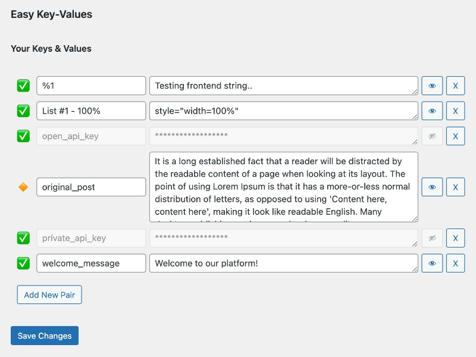

# Easy Key-Values Plugin for WordPress

Effortlessly manage key-value pairs, save custom settings, and retrieve them across your WordPress site with a shortcode
or PHP function.

## Description

**Easy Key-Values** helps you manage key-value pairs.. yes, easily. It lets site managers and developers save settings and use
them anywhere on their site with shortcode or PHP function. Use it for storing API keys, site settings, or showing
content simply and quickly. Additionally, the plugin offers the ability to hide sensitive information directly from the
WordPress admin, enhancing security and privacy.

### Key Features

- **Simple Management**: Easily add, edit, delete, and hide key-value pairs from the WordPress admin area.
- **Shortcode Support**: Display your settings anywhere on your site with a simple shortcode.
- **PHP Functionality**: Retrieve values in your theme or plugin with a straightforward PHP function.
- **Visibility Control**: Decide whether to show or hide specific key-value pairs, making it perfect for sensitive data.
- **Lightweight and Efficient**: Designed with performance in mind, ensuring minimal impact on your site's speed.
- **Optional Caching**: Improve performance with optional caching, configurable through `EKV_ENABLE_CACHE`
  and `EKV_CACHE_DURATION` constants.
- **Flexible Menu Placement**: Customize the admin menu placement using the `EKV_MENU_LOCATION` constant for better
  integration.

### Ideal for a Wide Range of Applications

- **API Key Storage**: Securely store and retrieve API keys for various services.
- **Dynamic Content Display**: Quickly show different content based on custom settings or user preferences.
- **Site Customization**: Easily manage and apply site-wide custom settings without touching code.
- **Development Efficiency**: Streamline development workflows by managing reusable data through the admin interface.
- **Multi-language Support**: Store and display language-specific text strings or URLs, enhancing your site's
  internationalization.

By using "Easy Key-Values", you unlock the potential for enhanced site customization, improved security for sensitive
data, and a more efficient development process.

## Installation

- Requires PHP 7.4+
- Requires WordPress 5.2+
- Tested up to: 6.4.3

1. Upload the `easy-key-values` folder to your `/wp-content/plugins/` directory or install it directly through the
   WordPress admin panel.
2. Activate the plugin via the 'Plugins' menu in WordPress.
3. Navigate to the 'Easy Key-Values' menu item in the admin area to start adding your key-value pairs.

## Advanced Configuration

- **`EKV_ENABLE_CACHE`**: Define this constant in your `wp-config.php` to enable or disable caching for key-value
  retrievals. Useful for improving performance on high-traffic sites.
- **`EKV_CACHE_DURATION`**: Customize the caching duration (in seconds) for key-value pairs by defining this constant.
  Works in conjunction with `EKV_ENABLE_CACHE`.
- **`EKV_MENU_LOCATION`**: Specify the admin menu location. Set this to "settings_menu" to place the menu under the '
  Settings' section.

## 🚀 Looking for custom web development services?

Reach out to me at [ysalitrynskyi+wp@gmail.com](mailto:ysalitrynskyi+wp@gmail.com) for expert assistance in design,
backend, frontend, marketing, and mobile app development. My team and I speak multiple languages and are committed to
delivering high-quality work faster than anybody else.

## Support Independent Developers

If you find **Easy Key-Values** useful and would like to support an independent developer, consider making a donation.
Your contribution helps us continue developing innovative tools and supports the open-source community.

### Crypto Donations

If you prefer to use cryptocurrency, here are the wallets you can send your support to:

- **Bitcoin:** `126MRj4UdQgoYA8TrWjvuBgDnwtCQ1AT2C`
- **Bitcoin (BEP20):** `0xf53d079b7cc105d338b16b6ce812121d295eee70`
- **Ethereum (ERC20, BEP20):** `0xf53d079b7cc105d338b16b6ce812121d295eee70`
- **USDT (TRC20):** `THfZPJNi5hLqg3FMVgeT4iy8PnsSpHzxx3`
- **USDC (XLM):** `GABFQIK63R2NETJM7T673EAMZN4RJLLGP3OFUEJU5SZVTGWUKULZJNL6` (MEMO: `341286132`)
- **Ripple (XRP):** `rNxp4h8apvRis6mJf9Sh8C6iRxfrDWN7AV` (MEMO: `372541950`)
- **Dogecoin (dogecoin):** `DEQ5cs2U5kKiBLSXmP81xU6Re5LtUFxcSx`

Thank you for your support!

## Frequently Asked Questions

### How do I display a value on a post or page?

Simply use the shortcode `[ekv_value key="your_key_name"]` to show the value of a key wherever shortcodes are supported.

### Can I access a value within my theme or plugin?

Absolutely, by embedding `<?php echo ekv_get_value('your_key_name'); ?>`, you can easily retrieve and display a value
within PHP. For hidden values, ensure proper access control is implemented.

## Help with Localization

We're looking to make **Easy Key-Values** accessible to even more users by supporting additional languages. If you're fluent in a language other than English and would like to contribute by helping with translation and localization, we would greatly appreciate your support.

This effort not only helps the plugin reach a wider audience but also supports the open-source community in creating tools that are more inclusive and accessible. If you're interested in contributing, please reach out at [ysalitrynskyi+wp@gmail.com](mailto:ysalitrynskyi+wp@gmail.com) or open a Pull Request.

## Changelog

### 1.0.0

- Initial release.

## License

This project is licensed under the GNU General Public License v2.0 or later - see
the [LICENSE](https://www.gnu.org/licenses/gpl-2.0.html) file for details.
